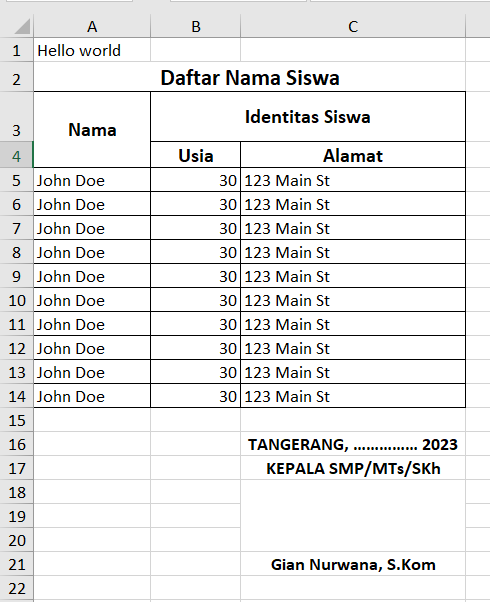

# EXPORT PHP SPREADSHEET

berikut merupakan contoh export excel dengan php spreadsheet

```php
<?php

require '../vendor/autoload.php';

use PhpOffice\PhpSpreadsheet\Cell\DataType;
use PhpOffice\PhpSpreadsheet\Spreadsheet;
use PhpOffice\PhpSpreadsheet\Style\Alignment;
use PhpOffice\PhpSpreadsheet\Style\Border;
use PhpOffice\PhpSpreadsheet\Writer\Xlsx;

$spreadsheet = new Spreadsheet();
$sheet = $spreadsheet->getActiveSheet();

$sheet->setCellValue('A1', 'Hello world');

// gabung cell
$sheet->mergeCells('A2:C2');
$sheet->getStyle('A2')->getAlignment()->setHorizontal(Alignment::HORIZONTAL_CENTER);

$style = $sheet->getStyle('A2');
$font = $style->getFont();
$font->setSize(14); // Ukuran font 14 poin
$font->setBold(true); // Mengatur gaya tebal (bold)
$sheet->setCellValue('A2', 'Daftar Nama Siswa');

// mengatu tinggi cell pada baris ke 3
$sheet->getRowDimension(3)->setRowHeight(30);

$style = $sheet->getStyle('A3:C3');
$style->getAlignment()
    ->setHorizontal(Alignment::HORIZONTAL_CENTER)
    ->setVertical(Alignment::VERTICAL_CENTER);
$font = $style->getFont();
$font->setSize(12); // Ukuran font 14 poin
$font->setBold(true); // Mengatur gaya tebal (bold)

$sheet->setCellValue('A3', 'Nama');
$sheet->setCellValue('B3', 'Usia');
$sheet->setCellValue('C3', 'Alamat');

$styleArray = [
    'borders' => [
        'allBorders' => [
            'borderStyle' => Border::BORDER_THIN,
            'color' => ['argb' => '000000'], // Warna border (hitam)
        ],
    ],
];

// contoh data
$data = [];
$sampleData = (object) ['nama' => 'John Doe', 'usia' => 30, 'alamat' => '123 Main St'];

for ($i = 0; $i < 10; $i++) {
    $data[] = $sampleData;
}

$row = 4; // Mulai dari baris ke-2
foreach ($data as $item) {
    $sheet->setCellValue('A' . $row, $item->nama);
    $sheet->setCellValueExplicit('B' . $row, $item->usia, DataType::TYPE_NUMERIC);
    $sheet->setCellValue('C' . $row, $item->alamat);
    $row++;
}

$limitRowData = $row - 1;
$sheet->getStyle("A3:C$limitRowData")->applyFromArray($styleArray);

// ttd kepala sekolah di column C baris 7
$rowMengetahui = $limitRowData + 2;
$rowKepalaSekolah = $limitRowData + 3;

$style = $sheet->getStyle("C$$rowMengetahui:C$rowKepalaSekolah");
$style->getAlignment()->setHorizontal(Alignment::HORIZONTAL_CENTER);
$style->getFont()->setBold(true)->setSize(11);

$sheet->setCellValue("C$rowMengetahui", "TANGERANG, …………… 2023");
$sheet->setCellValue("C$rowKepalaSekolah", "KEPALA SMP/MTs/SKh");

// baris kosong untuk tanda tangan
$rowKosongMulai = $sheet->getHighestDataRow('C') + 1;
$rowKosongSampai = $sheet->getHighestDataRow('C') + 3;
$sheet->mergeCells("C$rowKosongMulai:C$rowKosongSampai");

$rowNamaKepalaSekolah = $rowKosongSampai + 1;
$sheet->getStyle("C$rowNamaKepalaSekolah")->getAlignment()->setHorizontal(Alignment::HORIZONTAL_CENTER);
$sheet->getStyle("C$rowNamaKepalaSekolah")->getFont()->setBold(true);
$sheet->setCellValue("C$rowNamaKepalaSekolah", 'Gian Nurwana, S.Kom');

$sheet->getColumnDimension('A')->setAutoSize(true);
$sheet->getColumnDimension('B')->setWidth(10);
$sheet->getColumnDimension('C')->setAutoSize(true);

$writer = new Xlsx($spreadsheet);
$writer->save('hasil/dasar2.xlsx');
```

Hasil:

